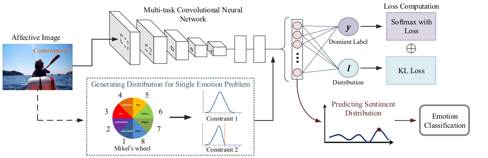

# Joint Image Emotion Classification and Distribution Learning via Deep Convolutional Neural Network

By Jufeng Yang, Dongyu She, Ming Sun

### Introduction

We develop a multi-task deep framework by jointly optimizing classification and distribution prediction


- It achieves state-of-the-art performance on emotion classification, and LDL prediction tasks.
- Our code is based on [Caffe](http://caffe.berkeleyvision.org/).

The paper has been accepted by IJCAI 2017. For more details, please refer to our [paper](https://www.ijcai.org/proceedings/2017/0456.pdf).

### Architecture

<p align="left">

</p>

### License

Our framework is released under the MIT License (refer to the LICENSE file for details).

### Citing

If you find our framework useful in your research, please consider citing:

    @inproceedings{ijcai2018joint,
    	Author = {Jufeng Yang, Dongyu She, Ming Sun},
    	Title = {Joint Image Emotion Classification and Distribution Learning via Deep Convolutional Neural Network},
    	booktitle = {IJCAI},
    	Year = {2017}
    }
    
### Contents

1. [Requirements: software](#requirements-software)
2. [Requirements: hardware](#requirements-hardware)
3. [Basic installation](#installation)
4. [Extra Downloads (dataset lmdb)](#download-dataset-lmdb)
5. [Usage](#usage)
6. [Trained models](#our-trained-models)

### Requirements: software

1. Requirements for `Caffe` (see: [Caffe installation instructions](http://caffe.berkeleyvision.org/installation.html))

  ```make
  # This is required only if you will compile the matlab interface.
  ```
  
### Requirements: hardware

1. NVIDIA GTX TITANX (~12G of memory)

### Installation

1. Clone the repository
  ```Shell
  git clone https://github.com/sherleens/EmotionDistributionLearning.git
  ```
  
2. Build Caffe with KLloss
  ```Shell
  cd $ROOT/caffe_KL
  # Now follow the Caffe installation instructions here
  #   http://caffe.berkeleyvision.org/installation.html
  # If you're experienced with Caffe and have all of the requirements installed
  # and your Makefile.config in place, then simply do:
  make all -j 8 && make matcaffe
  ```

### Download dataset lmdb

LMDB file is generated by modified code (caffe_KL/tool/convert_imageset_r) to support multiple ground-truth labels, which can also be downloaded [here]() for datasets with distribution annotations.

coming soon.

### Usage

**Train** a deep network. For example, train a VGG16 network on distribution datasets.

```Shell
cd prototxt && bash ./train_vgg_gs.sh
```

### Our trained models

The models trained on the distribution datasets can be downloaded from [here]().

coming soon.
